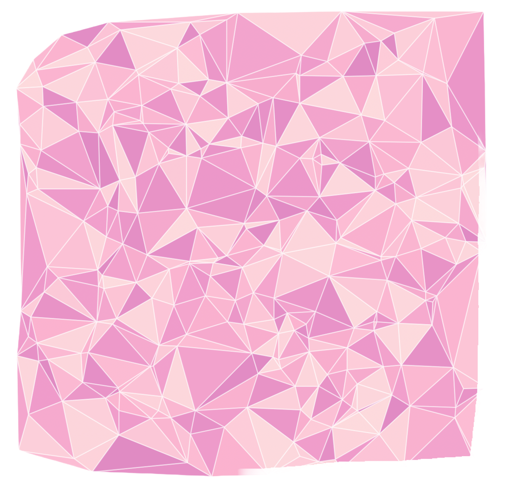
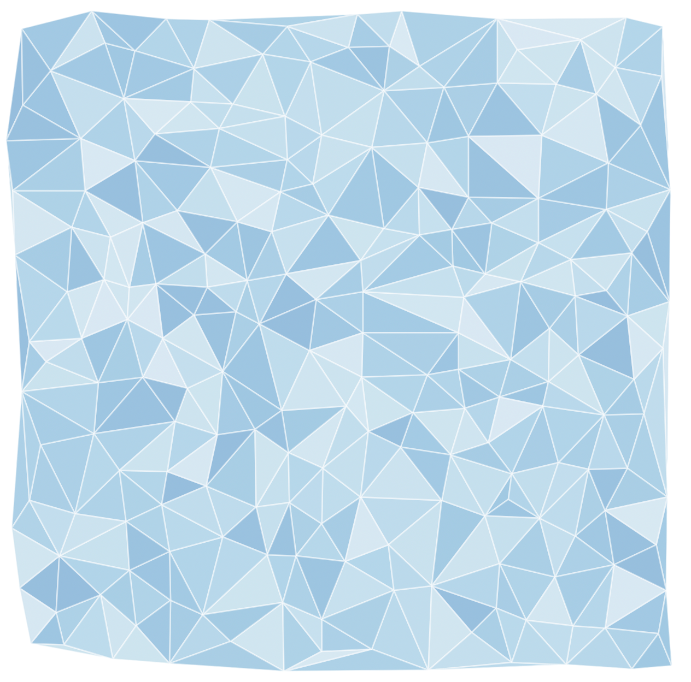

# Delaunay-Triangulation
Bowyer Watson implementation of Delaunay Triangulation with Best-Candidate point generation in Python.

| Best-Candidate Sampling | Random Sampling |
|:---:|:---:|
|  |  |
